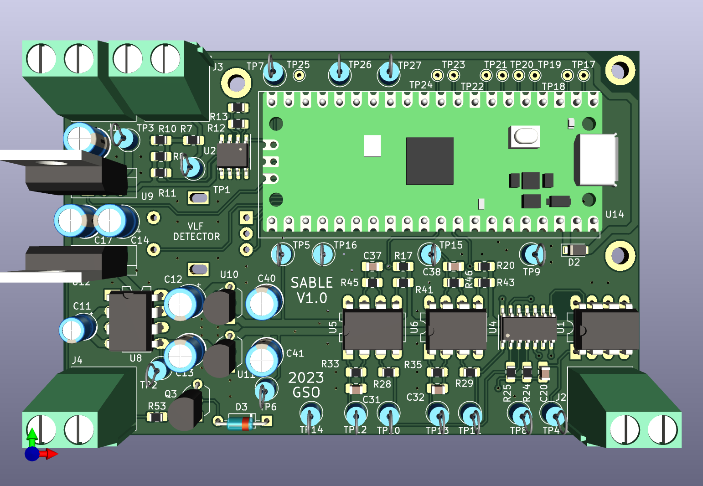
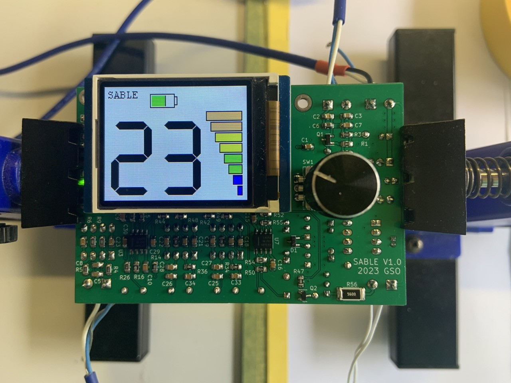
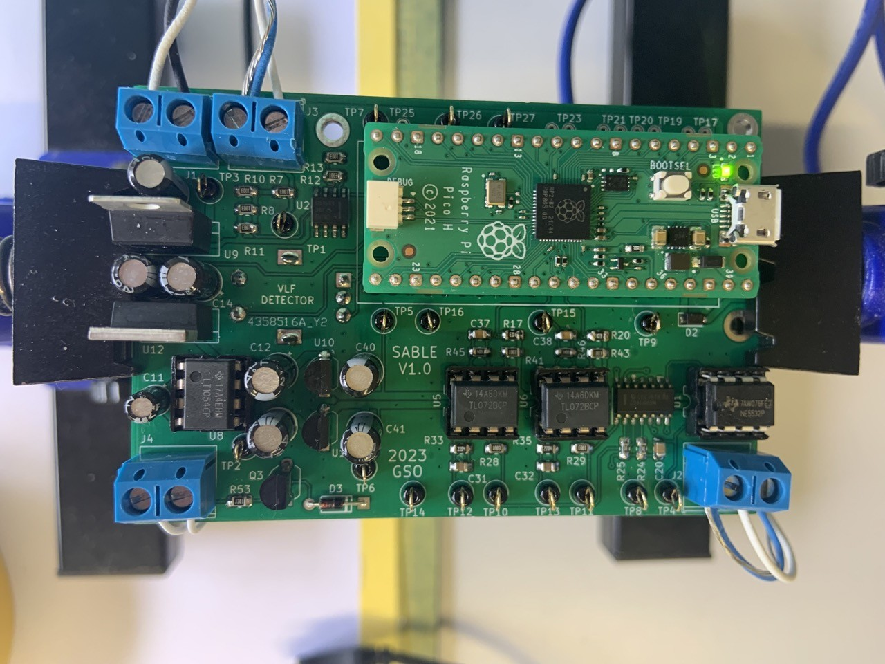

# Sable VLF Detector with VDI 

https://www.geotech1.com/forums/forum/technology/schematics/414267-sable-vlf-detector-with-vdi-inspired-by-the-raptor-project

Schematics, Gerber files and source code for Raspberry Pi PICO included.
